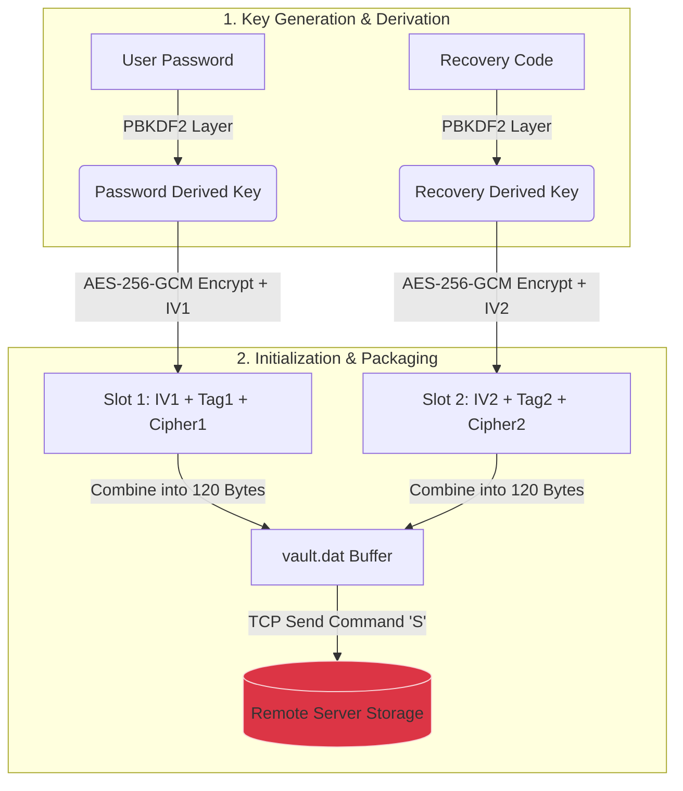

## Encryption Key Generation Flow


## Project Roadmap

### Phase 1: Core Security Stack (Encryption & Key Rotation)

Goal: Understand key hierarchies and the reset workflow.

- [x] **Key Derivation**: User Passphrase $\rightarrow$ Derived Key via PBKDF2.
- [x] **Master Vault**: Use the Derived Key to encrypt a single AES Key (representing the Key Set) and store it on the server.
- [x] **Backup & Restore**: Client uses the plaintext AES Key to encrypt/decrypt the target directory directly.
- [x] **Recovery Mechanism**: Generate a random string as the Recovery Code. During a reset, use it to decrypt the old AES Key, re-encrypt it with the new Derived Key, and update the server.

### Phase 2: Virtual Disk & Deduplication (Storage Efficiency)

Goal: Simulate block-level deduplication to prevent file-shifting issues using the simplest approach.

- [ ] **Mock Disk**: Use a single fixed-size file (e.g., a 10MB `mock.img`) on the client as the backup target.
- [ ] **Fixed-Size Chunking**: Slice the `mock.img` file into rigid 4KB blocks.
- [ ] **Hash-Based Deduplication**: Compute the SHA-256 hash for each 4KB block. The server stores blocks in a simple `Map<String, ByteArray>`; duplicate hashes are skipped during upload.

### Phase 3: Incremental Backup & Snapshots (Execution Efficiency)

Goal: Implement delta-transfers and basic version control.

- [ ] **Change Tracking (CBT Mock)**: Compare the current backup session with the previous one to identify 4KB blocks with modified SHA-256 hashes (Dirty Blocks).
- [ ] **Incremental Upload**: Transmit only the modified 4KB blocks to the server.
- [ ] **Snapshot Manifest**: For every successful backup, the server records a timestamp and a list of Chunk IDs (e.g., `Snapshot_V1 = [HashA, HashB, HashC]`).
- [ ] **Point-in-Time Recovery**: To restore a specific version, request its manifest from the server and reassemble the 4KB chunks back into the `mock.img` file.

## Getting Started

### 1. Compile and execute the server side

```bash
g++ -std=c++17 server.cpp -Iinclude -I/opt/homebrew/opt/openssl@3/include -L/opt/homebrew/opt/openssl@3/lib -lcrypto -o server
./server
```

### 2. Compile and execute the client side

```bash
g++ -std=c++17 client.cpp -Iinclude -I/opt/homebrew/opt/openssl@3/include -L/opt/homebrew/opt/openssl@3/lib -lcrypto -o client
./client
```